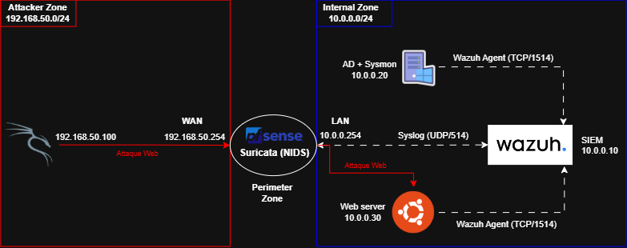
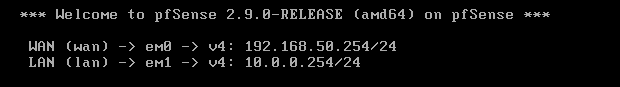

# Hybrid SOC Deployment & Threat Detection

**Duration:** 10 days  
**Technologies:** pfSense, Suricata, Wazuh, Elastic Stack, Windows Server (Sysmon), Ubuntu, Kali Linux.

## 1. Context & Business Objective

In modern corporate environments, centralizing security logs and maintaining strict network segmentation is critical for threat detection. The objective of this project is to build a hybrid Security Operations Center (SOC) lab from scratch. This infrastructure is designed to monitor both network traffic (via NIDS) and endpoint activity (via EDR), enabling real-time detection and automated response to simulated cyber attacks.

## 2. Technical Architecture

The environment is strictly segmented using a pfSense firewall to isolate the untrusted external zone from the internal corporate network, reflecting a realistic perimeter defense.

_Figure 1: Virtual infrastructure design isolating the WAN (Attacker) and LAN (Enterprise) zones._

- **Red Zone (Attacker):** Kali Linux (`192.168.50.100`) situated on an isolated external network (VMnet1).
- **Perimeter (NIDS/Firewall):** pfSense routing traffic between zones and hosting Suricata for network intrusion detection.
- **Internal Zone (Targets):** Windows Server with Sysmon (`10.0.0.20`) and an Ubuntu Web Server (`10.0.0.30`) on an isolated internal network (VMnet2).
- **Defense Zone (SIEM):** Wazuh Manager (`10.0.0.10`) ingesting logs via Syslog and Wazuh Agents.

## 3. Deployment (Build)

### 3.1. Network Segmentation & Routing

To ensure strict isolation, the virtualization environment relies on custom Host-Only networks without local DHCP services. The routing is entirely handled by the central pfSense instance.

- **WAN Interface (em0):** Assigned to `VMnet1` with static IP `192.168.50.254/24`.
- **LAN Interface (em1):** Assigned to `VMnet2` with static IP `10.0.0.254/24`.
- WebConfigurator (HTTPS) enabled on the LAN interface for firewall management.

  
_Figure 2: pfSense routing configuration establishing the foundation of the lab environment._
