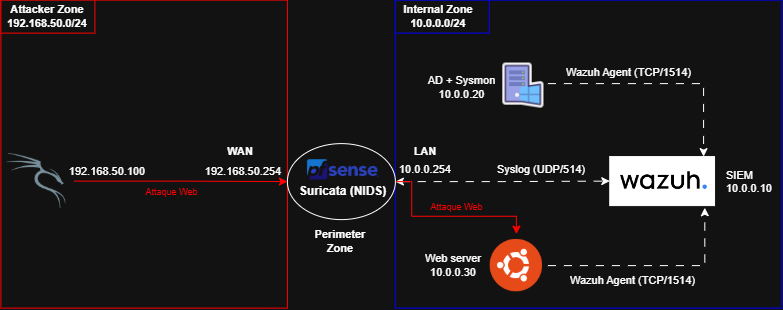
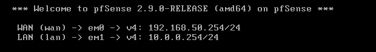
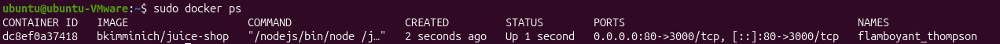
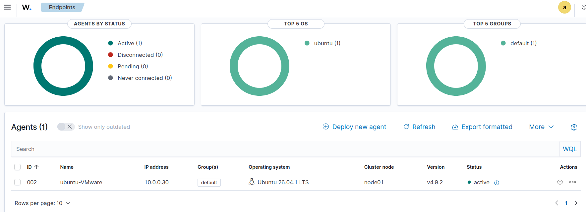
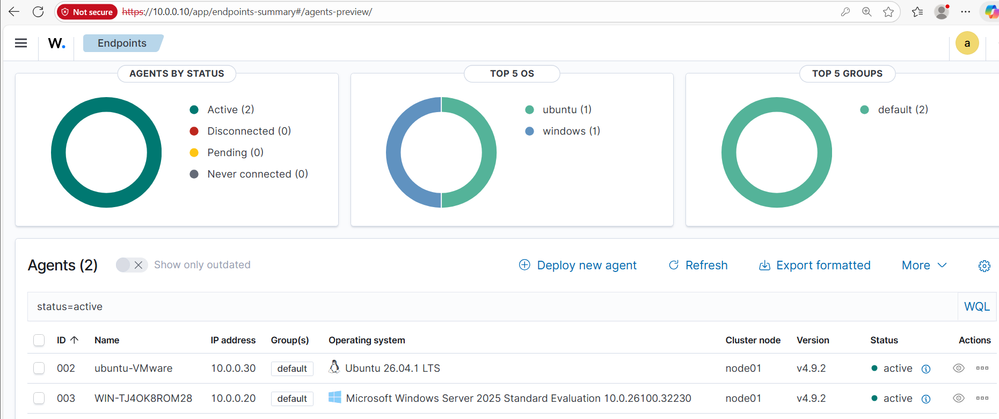
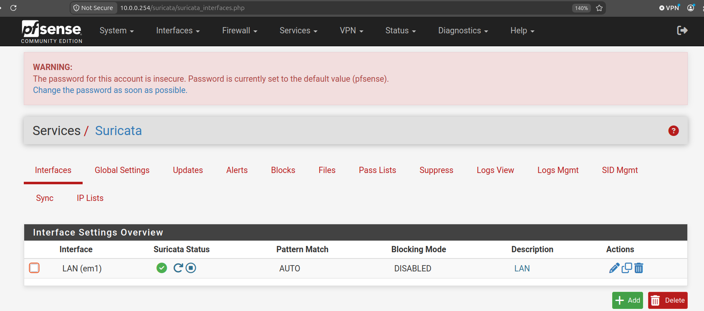
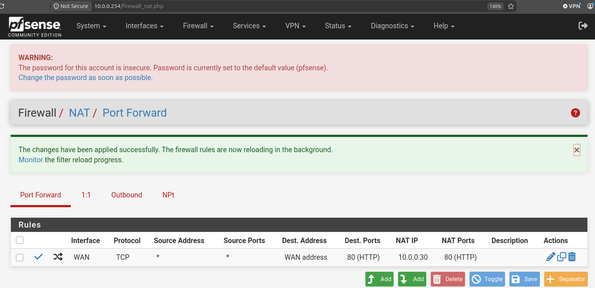
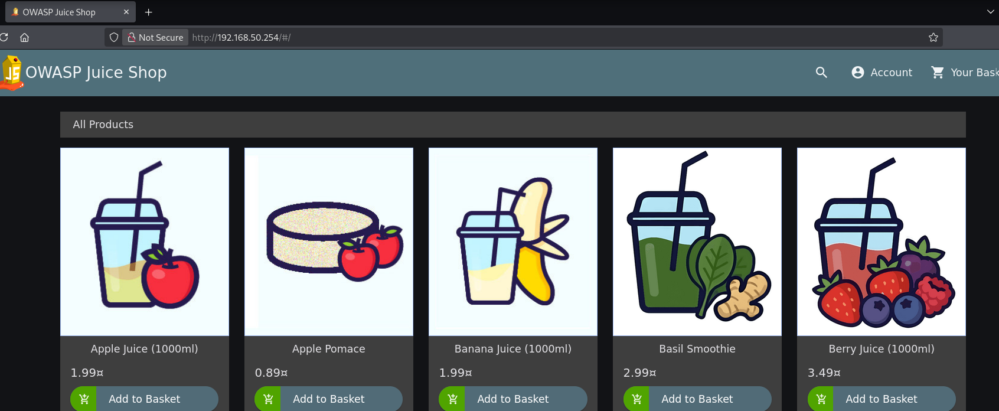
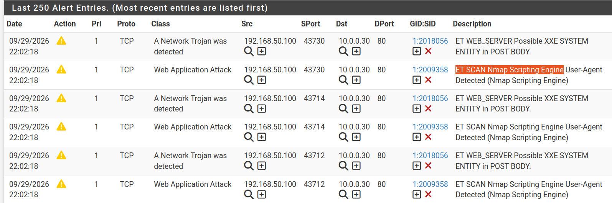

# Hybrid SOC Deployment & Threat Detection

**Technologies:** pfSense, Suricata, Wazuh, Elastic Stack, Windows Server (Sysmon), Ubuntu, Kali Linux.

## 1. Context & Business Objective

In modern corporate environments, centralizing security logs and maintaining strict network segmentation is critical for threat detection. The objective of this project is to build a hybrid Security Operations Center (SOC) lab from scratch. This infrastructure is designed to monitor both network traffic (via NIDS) and endpoint activity (via EDR), enabling real-time detection and automated response to simulated cyber attacks.

## 2. Technical Architecture

The environment is strictly segmented using a pfSense firewall to isolate the untrusted external zone from the internal corporate network, reflecting a realistic perimeter defense.


_Figure 1: Virtual infrastructure design isolating the WAN (Attacker) and LAN (Enterprise) zones._

- **Red Zone (Attacker):** Kali Linux (`192.168.50.100`) situated on an isolated external network (VMnet1).
- **Perimeter (NIDS/Firewall):** pfSense routing traffic between zones and hosting Suricata for network intrusion detection.
- **Internal Zone (Targets):** Windows Server with Sysmon (`10.0.0.20`) and an Ubuntu Web Server (`10.0.0.30`) on an isolated internal network (VMnet2).
- **Defense Zone (SIEM):** Wazuh Manager (`10.0.0.10`) ingesting logs via Syslog and Wazuh Agents.

## 3. Deployment (Build)

### 3.1. Network Segmentation & Routing

To ensure strict isolation, the virtualization environment relies on custom Host-Only networks without local DHCP services. The routing is entirely handled by the central pfSense instance.

- **WAN Interface (em0):** Assigned to `VMnet1` with static IP `192.168.50.254/24`.
- **LAN Interface (em1):** Assigned to `VMnet2` with static IP `10.0.0.254/24`.
- WebConfigurator (HTTPS) enabled on the LAN interface for firewall management.

  
_Figure 2: pfSense routing configuration establishing the foundation of the lab environment._

### 3.2. Firewall Initial Configuration

Access to the pfSense WebConfigurator was established via the internal LAN interface. To allow realistic attack simulations from the external Kali Linux machine, the default blockage of private networks (RFC1918) and bogon networks on the WAN interface was intentionally disabled. This critical adjustment ensures the firewall accurately routes and processes malicious traffic originating from the simulated external subnet (`192.168.50.0/24`).

### 3.3. Vulnerable Web Server Provisioning

An Ubuntu machine was provisioned within the internal zone (`10.0.0.30`) to act as the primary target for web-based attacks. To simulate a modern, realistic corporate application, the OWASP Juice Shop container was deployed via Docker.

```bash
sudo apt update && sudo apt install docker.io -y
sudo systemctl enable --now docker
sudo docker run -d -p 80:3000 bkimminich/juice-shop
```



### 3.4. SIEM Deployment (Wazuh Manager)

The core of the Security Operations Center is powered by a central Wazuh Manager instance (`10.0.0.10`), deployed on an isolated Ubuntu Server within the internal network. This node acts as the primary log ingestion, rule evaluation, and threat analysis engine.

- Network access is strictly restricted to the internal LAN, ensuring the security dashboard is only accessible via internal pivot points (e.g., the local administration subnet).
- The all-in-one deployment handles the Wazuh server, indexer, and dashboard components to centralize security telemetry.

### 3.5. Endpoint Telemetry (Linux Agent)

To ensure continuous monitoring of the vulnerable web target, the Wazuh agent was deployed on the Ubuntu server (`10.0.0.30`). The agent is configured to forward system logs, security events, and file integrity data directly to the central Wazuh Manager.



#### Troubleshooting: Agent Authentication Mismatch

During the initial deployment of the Ubuntu agent, a network context switch (from NAT to isolated LAN) caused a persistent `Disconnected` state. The agent logs (`/var/ossec/logs/ossec.log`) revealed a `Duplicate agent name` error, as the manager retained the initial DHCP-assigned IP address and rejected subsequent connections from the new static LAN IP (`10.0.0.30`) to prevent agent hijacking.

**Resolution:**

1. Purged the stale agent record directly from the Wazuh Manager database to release the hostname lock.
2. Restarted the Wazuh agent service on the endpoint (`sudo systemctl restart wazuh-agent`), forcing a fresh enrollment request.
3. The manager successfully issued a new cryptographic key, and telemetry resumed with the correct internal IP.

### 3.6. Windows Endpoint & Sysmon Integration

To establish deep visibility into the Windows environment (`10.0.0.20`), the standard event logging was augmented with Microsoft Sysmon.

- **Sysmon Deployment:** Configured using the SwiftOnSecurity baseline to filter noise and prioritize critical telemetry (process creation, network connections, and registry modifications).
- **Log Forwarding:** The Wazuh agent was deployed and explicitly configured to hook into the `Microsoft-Windows-Sysmon/Operational` event channel, streaming high-fidelity endpoint data back to the central SIEM on the isolated LAN.
- **Version Control:** Resolved an initial `Agent version must be lower or equal to manager version` error by downgrading the Windows agent to match the Manager's exact version (4.9.2), ensuring cryptographic compatibility.



### 3.7. Network Intrusion Detection (Suricata on pfSense)

To complement the endpoint telemetry provided by Wazuh, a Network Intrusion Detection System (NIDS) was deployed at the network perimeter.

- **Deployment:** Suricata was installed directly on the pfSense firewall to monitor all ingress and egress traffic between the isolated LAN (`10.0.0.0/24`) and the WAN.
- **Threat Intelligence:** The sensor is configured with the **ETOpen Emerging Threats** ruleset, providing signature-based detection for known malicious activity, network scans, and exploit attempts.
- **Visibility:** By monitoring the LAN interface, Suricata detects threats that have bypassed perimeter access controls, acting as a critical network-layer sensor for the SOC.



## 4. Offensive Simulation (Red Team)

To validate the defensive capabilities and alerting mechanisms of the hybrid SOC (Wazuh & Suricata), a controlled attack simulation was orchestrated from outside the internal network.

### 4.1. Adversary Infrastructure

A **Kali Linux** machine was deployed on the external WAN zone (`192.168.50.100`) to act as the threat actor. This network isolation ensures that the attack accurately simulates an external threat traversing the perimeter firewall, rather than a local lateral movement.

### 4.2. Target Exposure & NAT Configuration

The target is **OWASP Juice Shop**, a deliberately vulnerable web application hosted via Docker on the internal Ubuntu endpoint (`10.0.0.30`). Docker natively binds the application's internal port 3000 to the system's external port 80.
To expose this internal service to the external attacker, a **Port Forwarding (NAT)** rule was configured on the pfSense firewall:

- **Interface:** WAN
- **Protocol:** TCP
- **Destination:** WAN Address (Port 80)
- **Redirect Target:** `10.0.0.30` (Port 80)



This setup successfully mirrors a standard corporate environment where internal servers are shielded by a firewall, but specific services (like HTTP) are selectively published to the Internet.



### 4.3. Network Intrusion Detection & Attack Validation

To validate the detection capabilities of the Suricata NIDS positioned on the internal LAN interface, a controlled reconnaissance and vulnerability scan was launched from the external Kali Linux node.

- **Attack Vector:** Execution of targeted Nmap scripting engine modules (`http-enum`, `http-vuln*`) against the published web service.
- **SOC Response:** Suricata successfully intercepted the inbound malicious payload signatures as they traversed the internal network segment. The NIDS triggered clear signature-based alerts mapped to web server enumeration attempts and vulnerability probes.


